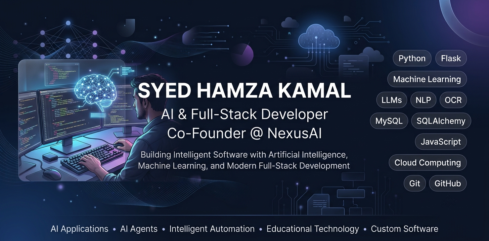
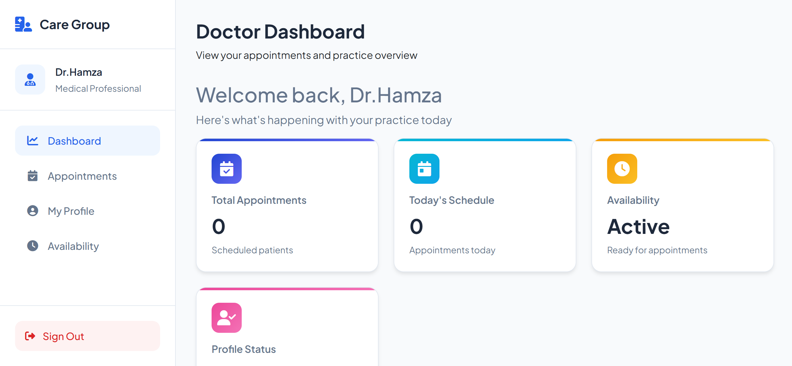

<!-- ========================================================= -->
<!--                   GITHUB PROFILE README                    -->
<!-- ========================================================= -->

<p align="center">
  
</p>

<p align="center">
  
</p>

<p align="center">

<a href="https://www.linkedin.com/me?trk=p_mwlite_feed-secondary_nav">

</a>

<a href="https://hamza200618.github.io/protfolio/">

</a>

<a href="mailto:syedhamzakamal48@gmail.com">

</a>


</p>

---

# 👋 Welcome

I'm **Syed Hamza Kamal**, an **AI & Full-Stack Developer** and **Co-Founder of NexusAI**, passionate about designing intelligent software that solves real-world problems through Artificial Intelligence, Machine Learning, and modern software engineering.

I specialize in building AI-powered web applications that combine scalable backend systems, intuitive user experiences, and intelligent automation. My work focuses on transforming complex ideas into practical digital solutions that people can genuinely benefit from.

Whether it's an AI-powered study platform, an intelligent chatbot, a CRM system, or a custom business application, I enjoy taking products from concept to deployment while maintaining clean architecture, maintainable code, and thoughtful design.

---

# 🚀 About Me

```yaml
Name:                Syed Hamza Kamal
Role:                AI & Full-Stack Developer
Company:             Co-Founder @ NexusAI
Location:            Karachi, Pakistan

Education:
  • BSc Cloud Computing & Information Sciences
    Sir Syed University of Engineering & Technology (SSUET)

  • Advanced Diploma in Software Engineering
    Aptech Learning

Current Interests:
  • Artificial Intelligence
  • Machine Learning
  • Large Language Models (LLMs)
  • AI Agents
  • Intelligent Automation
  • Cloud Computing
  • Software Architecture
```

---

# 💼 What I Build

I enjoy creating software that combines modern engineering practices with Artificial Intelligence to solve practical challenges.

### 🤖 Artificial Intelligence

- AI-powered Web Applications
- Large Language Model (LLM) Integrations
- AI Study Assistants
- AI Chatbots
- AI Agents
- Intelligent Automation Systems

### 🌐 Full-Stack Development

- Responsive Web Applications
- REST-based Backend Systems
- Authentication & Authorization
- API Integration
- Database Design
- Dashboard Development

### 🧠 Machine Learning

- Predictive Analytics
- Educational AI
- Learning Analytics
- Classification Models
- Model Training
- Performance Analysis

### 📄 Document Intelligence

- OCR Pipelines
- PDF Processing
- Text Extraction
- Natural Language Processing
- Semantic Analysis
- Intelligent Document Understanding

---

# 🎯 Current Focus

Currently, I'm investing most of my time in building products and expanding my expertise in AI and cloud technologies.

### 🚀 Flagship Project

**ExamMate AI**

An AI-powered Smart Study Assistant that helps students prepare for exams through:

- Intelligent tutoring
- AI-generated summaries
- Smart Guess Paper generation
- OCR-powered document processing
- Quiz generation
- Performance analytics
- Machine Learning predictions
- Learning dashboards

---

### 🏢 Building NexusAI

As Co-Founder of **NexusAI**, I'm working on delivering modern software solutions including:

- AI Applications
- AI Agents
- Intelligent Chatbots
- CRM Systems
- Business Automation
- Custom Web Applications

---

### 📚 Currently Exploring

- AI Agents
- Model Context Protocol (MCP)
- Retrieval-Augmented Generation (RAG)
- Advanced Prompt Engineering
- Cloud Computing
- Scalable AI Systems

---

# 💡 Development Philosophy

> **"Technology creates the greatest impact when it solves real problems. I believe software should be intelligent, scalable, maintainable, and genuinely useful for the people who rely on it."**

---

# 🛠️ Core Technologies

Organized by the technologies I use to build intelligent, scalable, and production-ready software.

---

## 🤖 Artificial Intelligence & Machine Learning

<p align="center">
  
</p>

<p align="center">


</p>

---

## ⚙️ Backend Development

<p align="center">

</p>

### Technologies

- Python
- Flask
- SQLAlchemy
- REST API Development
- Authentication Systems
- Session Management
- API Integration
- Server-side Application Development

---

## 🎨 Frontend Development

<p align="center">

</p>

### Technologies

- HTML5
- CSS3
- JavaScript (ES6+)
- Bootstrap
- Responsive UI Design
- Dashboard Interfaces
- Modern Web Components

---

## 🗄️ Database & Data Processing

<p align="center">

</p>

### Technologies

- MySQL
- SQLAlchemy ORM
- Database Design
- Data Modeling
- Pandas
- NumPy
- PyPDF2
- Document Processing

---

## 🛠️ Developer Tools

<p align="center">

</p>

### Tools

- Git
- GitHub
- GitHub Desktop
- Visual Studio Code
- Visual Studio
- Postman
- Microsoft Office

---

# 🚀 Flagship Projects

These are some of the projects that best represent my experience in Artificial Intelligence, Full-Stack Development, and intelligent software engineering.

---

## 🧠 ExamMate AI

An AI-powered Smart Study Assistant that transforms lecture notes and past papers into an intelligent learning platform.

<p align="center">
  
</p>

### Highlights

- 🤖 Claude AI Integration
- 📄 OCR-based PDF Processing
- 🧠 Machine Learning Analytics
- 📊 Learning Dashboard
- 📝 AI Guess Paper Generator
- 💬 AI Study Buddy
- 🎯 Smart Exam Predictor
- 📈 Performance Analysis
- 🧪 Adaptive Quiz System

<p align="center">

<a href="https://github.com/Hamza200618/ExamMate_AI">

</a>

</p>

---

## 🏫 Smart Campus Resource & Complaint Management System

A full-stack campus management platform developed to simplify complaint handling and university resource booking through an intuitive web interface.

<p align="center">
  
</p>

### Highlights

- Resource Booking
- Complaint Management
- Flask Backend
- MySQL Database
- User Authentication
- Administrative Dashboard

<p align="center">

<a href="https://github.com/Hamza200618/smart_campus">

</a>

</p>

---

## 🌐 NexusAI Company Portfolio

A modern company portfolio showcasing AI solutions, intelligent automation, web applications, chatbots, CRM systems, and digital services with a clean, futuristic interface.

<p align="center">
  
</p>

<p align="center">

<a href="https://github.com/Hamza200618/nexusai-company-portfolio">

</a>

</p>

---

## 🎨 Artora

A creative frontend project focused on modern UI design, smooth interactions, and immersive user experience.

<p align="center">
  
</p>

<p align="center">

<a href="https://github.com/Hamza200618/Artora">

</a>

</p>

---

## ❤️ CareGroup

A web-based platform developed to provide a clean and user-friendly experience while demonstrating practical full-stack development concepts.

<p align="center">
  
</p>

<p align="center">


</p>

---

# 📊 GitHub Activity

GitHub reflects not only the projects I've built but also my commitment to continuous learning, experimentation, and improving as a software engineer.

---


---

## 🔥 Contribution Streak

<p align="center">
  
</p>

---

## 📊 Contribution Graph

<p align="center">
  
</p>

---


---

# 🌱 Currently Learning

As technology evolves rapidly, I believe continuous learning is essential. I'm currently exploring:

- 🤖 AI Agents & Autonomous Workflows
- 🧠 Advanced Prompt Engineering
- 🔗 Model Context Protocol (MCP)
- 📚 Retrieval-Augmented Generation (RAG)
- ☁️ Cloud Computing & Cloud Architecture
- ⚡ Scalable AI Systems
- 🏗️ Software Architecture & Design Patterns
- 📊 Advanced Machine Learning Techniques

---

# 🎯 2026 Goals

- 🚀 Continue growing **NexusAI**
- 🎓 Complete my Bachelor's in Cloud Computing & Information Sciences
- 🤖 Build production-ready AI Agents
- 🌍 Deliver AI solutions for businesses and education
- 📦 Launch additional AI-powered products
- ☁️ Expand expertise in cloud platforms and deployment
- 🧩 Contribute to open-source projects
- 📖 Keep learning emerging AI technologies

---

# 🤝 Open to Collaboration

I'm always interested in collaborating on projects related to:

- Artificial Intelligence
- Machine Learning
- Full-Stack Web Development
- Educational Technology
- AI Agents
- Business Automation
- SaaS Applications
- Cloud-Based Solutions

If you're working on an exciting idea or looking for a collaborator, feel free to connect.

---

# 📫 Let's Connect

<p align="center">

<a href="mailto:syedhamzakamal48@gmail.com">

</a>

<a href="https://www.linkedin.com/me?trk=p_mwlite_feed-secondary_nav">

</a>

<a href="https://hamza200618.github.io/protfolio/">

</a>

<a href="https://github.com/Hamza200618">

</a>

</p>

---

# 💭 Favorite Quote

> *"The best way to predict the future is to build it."*

---

# ❤️ Thanks for Visiting

If you've made it this far, thank you for taking the time to explore my profile.

I'm always learning, building, and looking for opportunities to create meaningful software through Artificial Intelligence and Full-Stack Development.

⭐ **Feel free to explore my repositories, connect with me, or reach out for collaboration opportunities.**

---

# 📈 Profile Views

<p align="center">


</p>

---

# 🐍 Contribution Snake

<p align="center">


</p>

> **Note:** This animation is generated automatically by the GitHub Actions workflow at `.github/workflows/snake.yml` (added below). It renders on the first scheduled run after the workflow is committed — trigger it manually from the **Actions** tab (`Run workflow`) to make it appear immediately.

---

# 🚀 Beyond GitHub

I believe great software is more than writing code—it's about solving real-world problems through thoughtful engineering and intelligent design.

My goal is to build products that combine **Artificial Intelligence**, **Machine Learning**, and **Modern Full-Stack Development** to create software that is practical, scalable, and genuinely useful.

Whether it's an AI-powered educational platform, an intelligent business automation tool, or a custom web application, I enjoy transforming ideas into impactful digital products.

---

# 🏢 NexusAI

<p align="center">

### Building Intelligent Software for the Future

**AI Applications • AI Agents • Intelligent Automation • Chatbots • CRM Systems • Custom Software**

</p>

---

<p align="center">

*"Technology creates the greatest impact when it solves real problems."*

</p>

---

<p align="center">


</p>

---

<p align="center">

### ⭐ Thank you for visiting my GitHub Profile!

If you enjoy my work, consider exploring my repositories, following my journey, or connecting with me.

**Let's build something meaningful together.**

</p>

<!-- ========================================================= -->
<!--                    END OF README                           -->
<!-- ========================================================= -->
